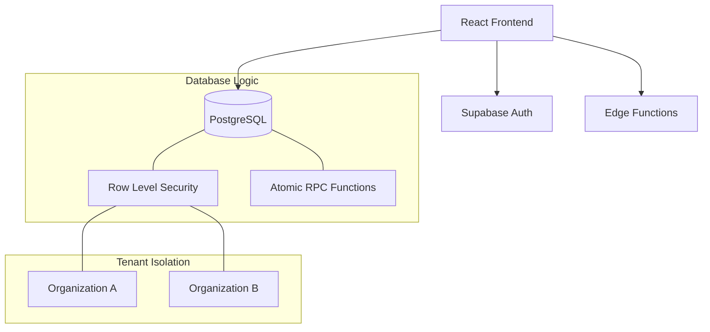
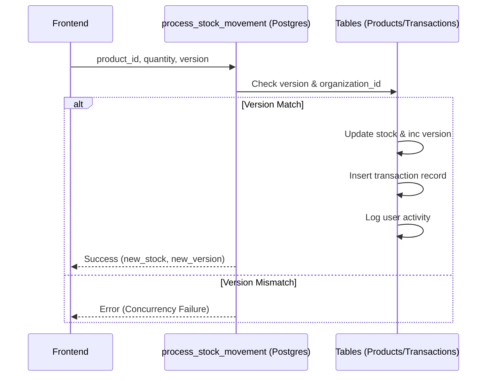

# Envanter Yönetim Sistemi - Devir Dokümantasyonu

Bu belge, **Envanter Yönetim Sistemi** projesinin teknik mimarisini, kritik mantık bloklarını ve operasyonel süreçlerini dış kaynak ekiplerin projeyi devralabilmesi için detaylandırmaktadır.

## 1. Genel Bakış ve Kurulum

### 1.1 Proje Amacı
Çok organizasyonlu (multi-tenant), rol tabanlı yetkilendirme (RBAC) ile güçlendirilmiş, gerçek zamanlı stok takip ve raporlama sistemidir.

### 1.2 Bağımlılıklar ve Ortam
- **Node.js**: v18+
- **Frontend**: vite + React 18 + TypeScript + Tailwind CSS
- **Backend/DB**: Supabase (PostgreSQL + Auth + RLS + Edge Functions)
- **Paket Yöneticisi**: npm

### 1.3 Kurulum Adımları
1. Bağımlılıkları yükleyin: `npm install`
2. `.env` dosyasını yapılandırın (Supabase URL & Anon Key).
3. Supabase migrations klasöründeki SQL dosyalarını sırayla veritabanında çalıştırın.
4. Geliştirme sunucusunu başlatın: `npm run dev`

---

## 2. Mimari Tasarım

### 2.1 Sistem Mimarisi
Uygulama, "Client-Side First" yaklaşımıyla geliştirilmiş olup, kritik veri bütünlüğü işlemleri veritabanı seviyesinde RPC (Remote Procedure Call) fonksiyonları ile yönetilmektedir.



### 2.2 Klasör Yapısı
```text
/src
  /components     # UI Bileşenleri (Atomic/Feature based)
  /lib            # Merkezi Servisler (Auth, Supabase, Logger)
  /types          # TypeScript Tip Tanımlamaları
/supabase
  /migrations     # Veritabanı Şeması ve RPC Fonksiyonları
  /functions      # Deno-based Edge Functions
/docs             # Detaylı Modül Dokümantasyonu (API, DB, User Guide)
```

---

## 3. Kritik Mantık Blokları (AI-Optimized)

### 3.1 Vektörel Atomik Stok Güncelleme (`process_stock_movement`)
Stok hareketleri frontend'den doğrudan tabloya yazılmaz. Bunun yerine AI tarafından optimize edilmiş olan `process_stock_movement` RPC fonksiyonu kullanılır.

**Neden Bu Yol Seçildi?**
- **Atomiklik**: Stok güncelleme + İşlem kaydı + Aktivite loglama tek bir transaction içinde yapılır.
- **Race Condition Koruması**: "Optimistic Locking" (versioning) kullanılarak aynı anda yapılan güncellemelerin birbirini ezmesi engellenir.



### 3.2 Toplu İçe Aktarma (`bulk_create_products`)
Yüzlerce ürünün aynı anda sisteme alınması için kullanılan bu fonksiyon, frontend-backend arasındaki request trafiğini minimize eder. AI tarafından O(n) performansında büyük veri setlerini işlemek üzere tasarlanmıştır.

---

## 4. API ve Veri Akışı

### 4.1 Veri İzolasyonu (RLS)
Sistemde **Row Level Security** her tabloda aktiftir. Bir kullanıcı `auth.uid()` üzerinden bağlı olduğu `user_roles` tablosundaki `organization_id` dışında hiçbir veriye erişemez.

### 4.2 Önemli Veri Modelleri
- **Products**: `version` kolonu optimistic locking için kritiktir.
- **Transactions**: Salt-okunur (Insert-only) bir denetim kaydıdır.
- **User Activity Logs**: JSONB formatında detaylı işlem geçmişi tutar.

---

## 5. Kalite Güvence ve Dağıtım

### 5.1 Kod Standartları
- **Linting**: ESLint ile TypeScript kuralları zorunlu kılınmıştır (`npm run lint`).
- **Type Check**: Üretim öncesi `npm run typecheck` komutu ile tip güvenliği denetlenir.

### 5.2 Dağıtım (Deployment)
1. **Frontend**: Vercel veya Netlify (Vite output `dist/` klasörü).
2. **Backend**: Supabase CLI üzerinden migrations ve functions push edilmelidir.
   - `supabase db push`
   - `supabase functions deploy stock-transaction`

> [!IMPORTANT]
> Proje devralındığında ilk olarak `database.types.ts` dosyasının veritabanı şemasıyla senkronize olduğunu doğrulayın.
